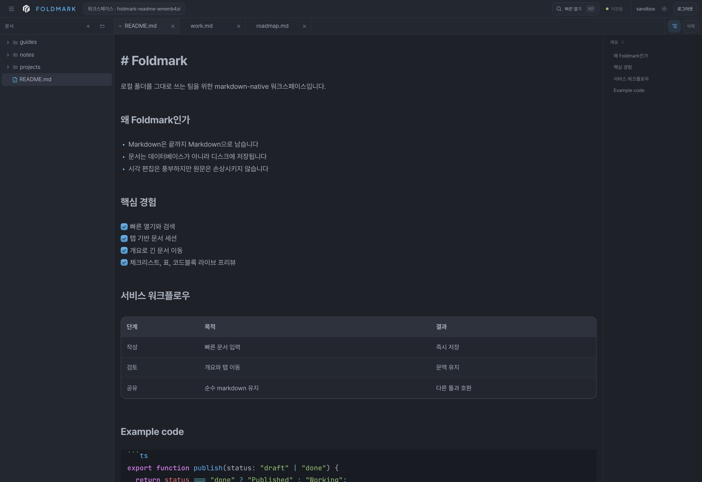
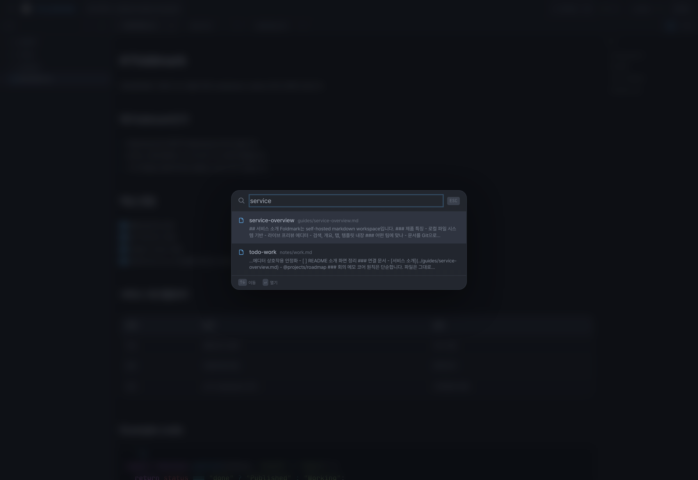
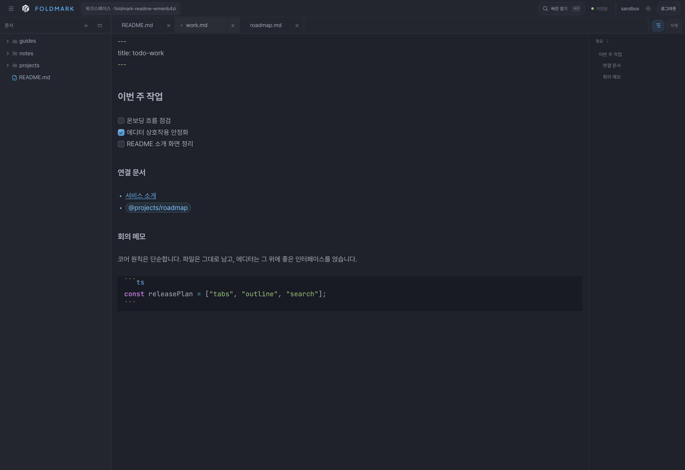

# Foldmark

[English](./README.md)

Foldmark는 1인 사용자를 위한 self-hosted Markdown workspace입니다.

일반 `.md` 파일이 들어 있는 폴더를, 탭, 빠른 열기, 개요, 라이브 프리뷰 편집이 있는 조용한 작업 공간으로 바꿔줍니다.  
중요한 점은 문서를 앱 안에 가두지 않는다는 것입니다.

## 왜 만들었나

문서 도구는 보통 둘 중 하나입니다.

- 파일은 남지만 사용감이 거칠거나
- 사용감은 좋지만 문서가 앱 내부 모델에 잠깁니다

Foldmark는 그 사이를 목표로 합니다.

- 노트는 일반 Markdown 파일로 남습니다.
- 워크스페이스는 여전히 디스크 위에 있습니다.
- 브라우저 UI는 그 파일들을 더 읽기 쉽고, 찾기 쉽고, 편집하기 쉽게 만들어주는 레이어가 됩니다.

즉 Foldmark는 팀 협업용 위키라기보다, 자기 문서를 오래 쌓아가는 개인 작업 공간에 가깝습니다.

## 어떤 느낌의 제품인가

- 빠르게 열리고
- 조용하게 쓰이고
- 파일 기반이고
- 편집은 시각적이지만 저장은 단순하고
- self-hosted 하기 쉬운 도구

## Screenshots

### 워크스페이스



### 빠른 열기



### 에디터



## 핵심 기능

### Markdown-first editor

- Markdown 원문을 유지하는 visual editor
- 체크리스트, 표, 코드블록, 링크, 구분선 라이브 프리뷰
- 긴 문서를 빠르게 이동하는 개요 패널
- 여러 문서를 오가도 맥락이 유지되는 멀티탭 세션

### Personal workspace tools

- 로컬 폴더 기반 파일 트리
- 빠른 열기와 검색
- 내부 문서 링크와 `@경로` 참조
- 템플릿과 에셋 업로드

### Self-hosted operation

- 로컬 계정 인증
- OIDC 로그인
- Docker / Docker Compose 배포
- 파일 기반 저장과 외부 변경 반영

## 이런 사람에게 맞는다

- 이미 Markdown 파일로 노트를 관리하는 사람
- 개인 위키, 연구 노트, 작업 로그, 설계 아카이브를 만들고 싶은 사람
- Git 친화적 파일 구조를 선호하는 사람
- 문서 소유권은 유지하면서 인터페이스만 좋아지길 원하는 사람

## 데이터는 어디에 저장되나

Foldmark의 모델은 단순합니다.

- 문서는 `.md`
- 에셋은 `.assets/`
- 앱 메타데이터는 `.docs/`

예시:

```text
workspace/
├── .assets/
├── .docs/
├── notes/
├── guides/
└── *.md
```

즉 Foldmark 자체가 원본이 아니라, 폴더가 원본입니다.

## 서버에 배포해서 실행하기

### 1. 웹 의존성 설치

```bash
npm --prefix packages/web ci
```

### 2. 루트 `.env` 생성

```bash
cp deploy/env.template .env
```

예시:

```env
WORKSPACE_ROOT=/data
WORKSPACE_ROOT_HOST=/srv/foldmark-data
HOST=0.0.0.0
PORT=3001
PUBLIC_HOST=docs.example.com
```

### 3. Foldmark 실행

```bash
npm run serve
```

그 다음 다음 주소로 접속합니다.

```text
http://127.0.0.1:3001
```

최초 실행 시 Setup 화면에서 로컬 계정을 만들거나 OIDC 공급자를 연결하면 됩니다.

### Docker

```bash
docker compose --env-file .env -f deploy/docker/compose.yml up -d --build
```

현재 compose 파일 기준으로, 별도 배포용 `.env`와 bind-mounted workspace 경로 조합으로 설정 검증을 마쳤습니다.

## 라이선스

MIT. 자세한 내용은 [LICENSE](./LICENSE)를 참고하세요.
